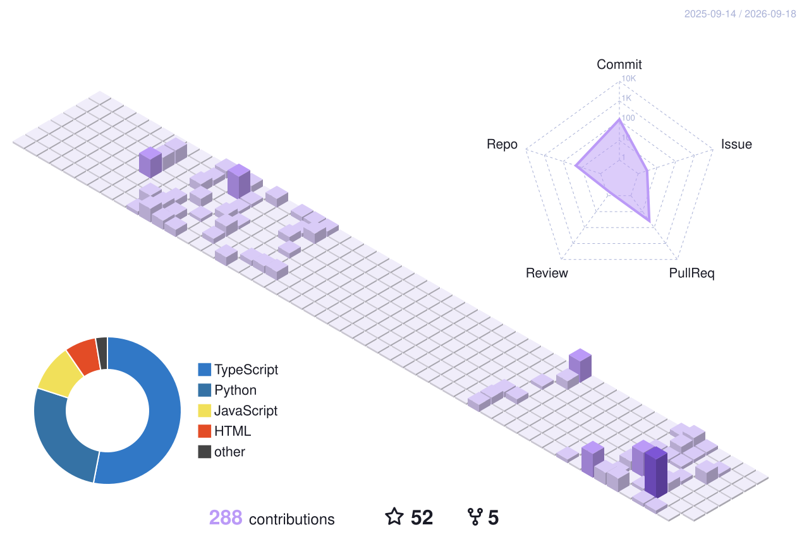

# 👋 Hello, I'm left-to-right

**19 岁的前端学习者 · AI Agent 爱好者 · 喜欢把复杂的东西讲简单**

<!-- 天气横幅:living-scene Action 每 3 小时按上海天气重绘 -->
<picture>
  <source media="(prefers-color-scheme: dark)" srcset="sky-night.svg" />
  
</picture>

## 🌱 关于我

- 🎓 19 岁,持续学习前端与 AI Agent
- ✍️ 维护 **clean-* 系列**:把 Vite / Webpack / React / Vue3 的原理讲给新手听
- 🤖 关注 **AI Agent / MCP / 大模型应用**,正在构建 Web 调试工具链
- 🚀 代表作 [**AI-learning-blog**](https://github.com/zhang17-24/AI-learning-blog) ★49:帮每个人搭建自己的学习博客

## 🛠️ 技术栈

## 📊 GitHub 数据

### 🗓️ 3D 贡献日历

<!-- 由 GitHub Action 每日生成,自动适配明暗主题 -->

  

### 🌳 我的贡献盆栽

<!-- 由 git-bonsai Action 每日生长:账号年龄定树干、连续提交开樱花 -->

  

<!-- 如果你有海外网络/VPN,可以把上面换成 github-readme-stats 系列卡片(国内直连超时):

-->

## 🚀 精选项目

| 项目 | 说明 | 语言 |
| --- | --- | --- |
| [AI-learning-blog](https://github.com/zhang17-24/AI-learning-blog) ★49 | 帮每个人搭建自己的学习博客 | TypeScript |
| [clean-vue3](https://github.com/zhang17-24/clean-vue3) | 新手向 Vue3 原理讲解 | JavaScript |
| [clean-React](https://github.com/zhang17-24/clean-React) | 新手向 React 原理讲解 | JavaScript |
| [clean-vite](https://github.com/zhang17-24/clean-vite) | 新手向 Vite 打包原理讲解 | JavaScript |
| [clean-webpack](https://github.com/zhang17-24/clean-webpack) | 新手向 Webpack 打包原理讲解 | JavaScript |
| [web-devhander](https://github.com/zhang17-24/web-devhander) | MCP + Chrome DevTools 网页调试工具链 | JavaScript |
| [docmost-agent](https://github.com/zhang17-24/docmost-agent) | Docmost 社区版二次开发,学习 AI/Agent 功能 | TypeScript |

### ✍️ clean-* 系列的理念

> 市面上很多教程一上来就讲源码,新手根本看不懂。我想换一种方式:
> **先讲清楚"它为什么存在",再讲"它怎么工作"**。
> 每个 clean-* 项目都是一份可运行、带注释的最小实现,配合文章循序渐进。

## 📫 联系我

- 💬 邮箱:2201218482@qq.com
- 🌐 GitHub:[zhang17-24](https://github.com/zhang17-24)

---

*「把复杂的东西讲简单,是最高级的表达」*

<!-- 花园页脚:四季变化,一只猫住在里面 -->

  <picture>
    <source media="(prefers-color-scheme: dark)" srcset="garden-footer-night.svg" />
    
  </picture>

<!-- ================= 可选增强(部署后自行启用) ================= -->

<!-- ## 🐍 贪吃蛇动画
需要在本仓库配置 GitHub Actions(Platane/snk),生成到 output 分支后启用:

-->